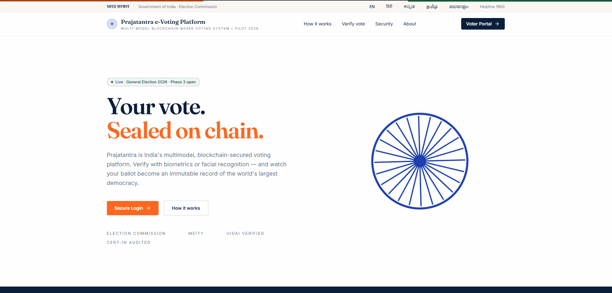

# Multimodal Blockchain based Voting System

[](https://github.com/Mohammed0572/VotingSystem/actions/workflows/codeql.yml)


This project is an academic prototype that combines biometric authentication, server-side eligibility checks, and tamper-evident blockchain vote recording.

The blockchain protects accepted vote transactions from ordinary modification. The authentication service, voter registry, credential issuance process, and transaction relayer remain centralized trusted components. The system is not a production election protocol and does not provide cryptographic anonymity, coercion resistance, or complete protection against malicious administrators.

## Deployed Contract

Network: Configure the deployment network locally or through environment variables.
Contract Address: Set `VITE_CONTRACT_ADDRESS` after deployment.
Etherscan: Add the deployed address only after a real Sepolia deployment.

### Dashboard Overview


_The centralized, modern interface for managing the election process securely._

### System Architecture


### Usecase Diagram


---

## How the System Works

The voting process is divided into clear, secure stages to ensure the integrity of the election from start to finish.

### 1. Voter Registration

Before an election begins, eligible voters are registered into the system by the administration.

- The voter's facial biometric data is captured via webcam and securely encoded.
- Each voter is assigned a unique Voter ID linked to their biometric profile.

### 2. Secure Authentication (Face Recognition)

When a voter wants to cast their vote, they must pass a strict authentication process:

- The voter enters their unique Voter ID on the login page.
- The system activates the webcam to perform a live facial scan.
- The live scan is compared against the securely stored biometric data.
- If the face matches, the system verifies the voter's identity and grants them a secure, temporary session to access the voting booth. This prevents anyone from logging in with a stolen password.

### 3. The Voting Process (Blockchain)

Once inside the secure voting dashboard:

- The voter is presented with the list of participating candidates.
- The voter makes their selection and casts their vote.
- The vote is submitted to the FastAPI service, which relays it to a **Smart Contract** deployed on the Ethereum blockchain.
- The Smart Contract verifies that the relayer credential has not already been used.
- Once verified, the vote is permanently recorded on the blockchain ledger.

### 4. Election Management (Admin Dashboard)

Administrators have access to a separate, secure dashboard where they can:

- Define the election parameters (Start Date and End Date).
- Add or manage the list of candidates.
- Monitor the ongoing election securely.

---

## Core Security Features

- **Facial Recognition Authentication:** The system uses facial recognition, image-quality checks, and passive blink-based liveness detection as prototype authentication controls. These controls are not production-grade anti-spoofing.
- **Tamper-evident recording:** Accepted vote transactions are recorded on Ethereum and are resistant to ordinary modification after confirmation.
- **Trusted services:** Authentication, voter eligibility, credential issuance, and transaction relaying remain centralized and can deny service or submit incorrect data if compromised.
- **Double-Voting Prevention:** The smart contract logic strictly enforces the rule that one person gets exactly one vote. Any attempt to vote twice is automatically rejected by the blockchain network.

### Liveness Detection (Blink-Based)

To reduce the risk of a static photo being used to spoof face
authentication, the verification flow includes a lightweight
passive-liveness check based on eye blink detection.

**How it works:**

- During the live face-scan sequence, facial landmarks are extracted
  for each frame using the existing `face_recognition` / `dlib`
  landmark pipeline (already in use for face matching).
- The Eye Aspect Ratio (EAR) is computed per frame from the eye
  landmark points:

EAR = (‖p2 - p6‖ + ‖p3 - p5‖) / (2 \* ‖p1 - p4‖)

where `p1..p6` are the six landmark points around one eye.

- A natural blink produces a brief drop in EAR below a threshold
  (commonly ~0.2) followed by a recovery. The verification sequence
  requires **at least one such drop-and-recover pattern** across the
  captured frames before the face match is accepted.
- If no blink pattern is detected across the capture window, the
  request is rejected with a "liveness check failed — please blink
  naturally and try again" message, and the user can retry.

**Scope and limitations:**

- This is a **passive, single-signal liveness check** — it blocks the
  simplest spoofing attempt (a static printed photo or a still image)
  but is not a full anti-spoofing solution (e.g. it would not reliably
  detect a video replay of the enrolled voter blinking).
- No new dependencies are required — EAR computation uses the same
  landmark points already extracted for face matching.

### Match Threshold Justification

The face-matching system uses a fixed distance threshold
(`MATCH_TOLERANCE = 0.55`) to decide accept/reject. A full FAR / FRR /
EER evaluation across a labelled dataset was considered
(see Issue #125) and explicitly deprioritized for this phase of the
project. In its place, the threshold was sanity-checked manually
before being finalized.

**Manual verification performed:**

- A small manual test set was used: known **genuine pairs** (a
  voter's own enrolled face vs. a fresh live capture) and known
  **impostor pairs** (a voter's live capture vs. another voter's
  stored encoding).
- Each pair was run through the existing
  `face_recognition.face_distance` pipeline, and the resulting
  distance was checked against `0.55`:
  - Genuine pairs consistently returned distances **below** 0.55
    (correctly accepted).
  - Impostor pairs consistently returned distances **above** 0.55
    (correctly rejected).
- No genuine pair was incorrectly rejected and no impostor pair was
  incorrectly accepted across this manual sample.

**Scope and limitations:**

- This is a **manual spot-check on a small sample**, not a formal
  statistical evaluation — it does not produce FAR, FRR, or EER
  figures, and the sample size is too small to generalize with
  confidence.
- `0.55` is retained as a practical value that behaved correctly on
  the cases tested, not as a value derived from a measured error-rate
  curve.
- A full FAR/FRR/EER evaluation (Issue #125) remains the correct next
  step if stronger, statistically-backed justification is needed in
  the future.

---

## CodeQL Security Scan Status

The project utilizes GitHub's automated **CodeQL analysis** to continuously scan the codebase for security vulnerabilities, code quality issues, and compliance.

### Latest Scan Status

- **Status:** [](https://github.com/Mohammed0572/VotingSystem/actions/workflows/codeql.yml) (Passing / Clean)
- **Coverage:** Scans both **JavaScript/TypeScript** (Frontend & Express App) and **Python** (FastAPI Authentication Server) codebases.
- **Trigger:** Automated analysis is performed on every push to the `main` branch, pull requests, and scheduled weekly (every Sunday at 01:30 UTC).

### Security Review Outcomes & Resolved Issues

In recent security remediation cycles, all identified vulnerabilities have been systematically resolved:

1. **Authentication Security & Secret Management**
   - **Remediation:** Split configuration secrets into unique client-side (`NODE_SECRET_KEY`) and server-side (`FASTAPI_SECRET_KEY`) JWT signing secrets.
   - **Production Hardening:** Integrated `envalid` to validate required environment variables at startup, disabling dangerous fallback defaults in production.
2. **Brute-Force & Denial of Service (DoS) Mitigation**
   - **Rate Limiting:** Integrated `slowapi` (backed by Redis with an in-memory fallback for local dev) on the FastAPI face authentication endpoints. `/verify-face` is rate-limited to 5 requests per minute per IP, and `/enroll-face` is limited to 10 requests per minute per IP.
   - **Payload Size Guards:** Implemented strict request payload limits (maximum of 2MB per image sequence) to block memory-exhaustion DoS attacks.
3. **Input Sanitization & Injection Prevention**
   - **Form Field Safety:** Implemented strict `maxLength={64}` limits and disabled auto-completion on Login views.
   - **Regex Restraints:** Added paste listeners (`handlePaste`) to reject non-alphanumeric inputs or values exceeding length limits.
   - **Vote Integrity:** Enforced candidate verification checks on vote submissions in the frontend, preventing attempts to inject invalid candidate IDs.
   - **Unused Code Cleanup:** Completely removed the experimental MongoDB backend (`server/` directory) to reduce the attack surface and eliminate potential NoSQL injection vectors.
4. **Replay & Side-Channel Protections**
   - **Anti-Replay Nonces:** Added cryptographic random UUID nonces and timestamps to verification requests to block capture-and-replay exploitation.
   - **Information Disclosure Mitigation:** Removed the face-matching proximity `distance` score from the public `/verify-face` response payload to prevent side-channel reverse-engineering of user faces.
5. **Secure Headers & Strict CORS**
   - **Response Hardening:** Added middleware to both Express and FastAPI servers to set strict `Content-Security-Policy` (CSP), `Permissions-Policy` (camera enabled only for self, microphone/geolocation disabled), `X-Frame-Options: DENY`, `X-Content-Type-Options: nosniff`, and `Referrer-Policy` headers.
   - **Origin Restriction:** Configured CORS origins on the FastAPI server to strictly allow only the specified frontend origin.

### Outstanding Findings

- **None:** There are currently no outstanding security alerts or vulnerabilities detected by CodeQL.

---

## Project Structure

```text
├── server/
│   ├── face-recognition/         # FastAPI face authentication service
│   ├── blockchain/               # Solidity smart contracts, migrations, and Truffle configs
│   └── deploy/                   # Docker orchestration & deployment configs (nginx, vercel)
├── docs/                         # Project documentation and security notes
├── src/                          # Frontend source files (HTML/CSS/JS/TS)
├── index.ts                      # Express server entry point (Frontend)
└── README.md                     # Documentation
```

---

## Getting Started Locally

Follow these steps to download and run the project on your local machine.

### Prerequisites

- [Node.js](https://nodejs.org/) (v18+)
- [pnpm](https://pnpm.io/) (`npm install -g pnpm`)
- [Python](https://www.python.org/) (v3.10 recommended)
- [Ganache](https://trufflesuite.com/ganache/) (Local Ethereum blockchain)
- [MetaMask](https://metamask.io/) browser extension
- [Truffle](https://trufflesuite.com/truffle/) (`npm install -g truffle`)
- Webcam (for facial recognition)

### 1. Download the Repository

You can either fork the repository on GitHub or download it directly to your machine:

```bash
git clone https://github.com/Mohammed0572/VotingSystem.git
cd VotingSystem
```

### 2. Install Dependencies

Install the Node.js packages for the frontend using `pnpm`:

```bash
pnpm install
```

Install the Python packages for the Face Authentication API:

```bash
cd server/face-recognition
pip install -r requirements.txt
cd ../..
```

_(Note: The `face_recognition` Python library requires `dlib`, which may need CMake and a C++ compiler installed on your system.)_

### 3. Configure the Environment

Copy the example environment files and set them up:

```bash
cp .env.example .env
cp server/face-recognition/.env.example server/face-recognition/.env
```

Generate two unique secure secret keys by running this command twice:

```bash
node -e "console.log(require('crypto').randomBytes(64).toString('hex'))"
```

Place one key as `NODE_SECRET_KEY` in the root `.env` file, and the other as `SECRET_KEY` in `server/face-recognition/.env`.

### 4. Start the Blockchain (Ganache)

1. Open **Ganache** and create a new workspace (e.g., named "development").
2. Link it to the `blockchain/truffle-config.js` file in the project root.
3. Configure your **MetaMask** extension to connect to `http://localhost:7545` (Chain ID 1337) and import an account using one of Ganache's private keys.

### 5. Compile and Deploy Smart Contracts

Open a terminal in the root directory. You can deploy either to your local Ganache network or to the public Sepolia testnet.

**For Local Development (Ganache):**

```bash
cd server/blockchain
npx truffle compile
npx truffle migrate
```

**For Public Testnet (Sepolia):**
Ensure you have set the `SEPOLIA_RPC_URL` (e.g., from [Alchemy](https://alchemy.com) or [Infura](https://infura.io)) and `MNEMONIC` in your `.env` file, and that your account has some Sepolia testnet ETH.

```bash
cd server/blockchain
npx truffle compile
npx truffle migrate --network sepolia
```

### 6. Build or Run the Frontend

The frontend uses Vite and React. You can either run the development server or build for production.

**For Development (Recommended):**

```bash
npm run dev
```

**For Production:**

```bash
npm run build
npm run serve
```

### 7. Run the Local Stack

For local development, start everything with one command. This starts Ganache,
deploys the voting contract, configures the voting relayer, and starts both the
FastAPI and frontend servers:

```bash
make dev
```

For manual server startup:

You need to run two servers simultaneously in separate terminals:

**Terminal 1: Start the Face Auth API**

```bash
cd server/face-recognition
python -m uvicorn main:app --host 127.0.0.1 --port 8000
```

**Terminal 2: Start the Frontend Server**
If you are using the development server, `npm run dev` is already running. If you built for production, ensure `npm run serve` is running.

### 8. Access the App

Open your web browser and go to:

- **http://localhost:8080** (if using `npm run dev`)
- **http://localhost:8080** (if using `npm run serve`)

---

## Testing

This project includes automated testing suites for the Smart Contracts, Backend API, and Frontend components.

### 1. Smart Contracts (Truffle)

The solidity smart contracts are tested using Truffle and Mocha/Chai. Ensure Ganache is running before executing the tests.

```bash
cd server/blockchain
npx truffle test
```

### 2. Backend API (pytest)

The FastAPI backend is tested using `pytest`. The tests mock the face recognition modules to run quickly without needing real webcam input.

```bash
cd server/face-recognition
pytest
```

### 3. Frontend (Vitest)

The React frontend components are tested using Vitest and React Testing Library.

```bash
npm run test
```

---

## Contributors

This system was developed as a Major Project at K.S. School of Engineering and Management by:

- [**toxicbishop**](https://github.com/toxicbishop)
- [**Mohammed0572**](https://github.com/Mohammed0572)
- [**supr1795**](https://github.com/supr1795)
- [**Rohithgaloth**](https://github.com/Rohithgaloth)

## License

This project is licensed under the MIT License. See the [LICENSE](LICENSE) file for details.
